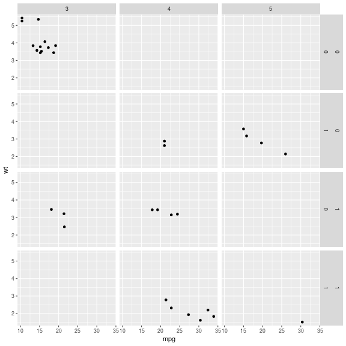
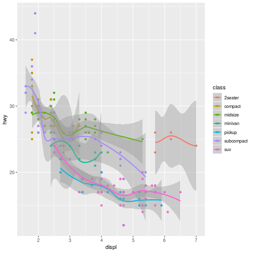

Publication-quality graphics
========================================================
author: 
date: 
autosize: true

Intro
========================================================

* This is a big topic!
* We are only covering programmable graphics, namely 
those that can be made directly from data files.

Writing
=======================================================

* Success in science means being a professional writer.
* A key part of this is effective visualization of results.
* This is time-consuming work.

Putting papers together
========================================================

* Write Methods to break writer's block
* Make figures
* Write about the figures
* Write Discussion, Intro, Abstract
* Reread it all and write title

History of plotting in R
=======================================================

* Base R lets you do pretty much anything, but it can be quite hard.
* `grid` and `gridExtra` came along to make various layout tasks easier
* `lattice` came along to allow "trellis" plots
* `ggplot2` tries to simplify the grammar, unify previous disparate concepts, in order to let you do EDA faster.

Setup
======================================================


```r
library(ggplot2)
library(datasets)
head(mtcars)
```

```
                   mpg cyl disp  hp drat    wt  qsec vs am gear carb
Mazda RX4         21.0   6  160 110 3.90 2.620 16.46  0  1    4    4
Mazda RX4 Wag     21.0   6  160 110 3.90 2.875 17.02  0  1    4    4
Datsun 710        22.8   4  108  93 3.85 2.320 18.61  1  1    4    1
Hornet 4 Drive    21.4   6  258 110 3.08 3.215 19.44  1  0    3    1
Hornet Sportabout 18.7   8  360 175 3.15 3.440 17.02  0  0    3    2
Valiant           18.1   6  225 105 2.76 3.460 20.22  1  0    3    1
```

Let's list what is wrong with this plot
==============================================================



Let's list what is wrong with this plot
==============================================================



Colors
========================================

* Avoid plots that color-blind people cannot see
* Use shapes, line types, etc.
* [here](http://www.cookbook-r.com/Graphs/Colors_(ggplot2\))
* [viridis](https://cran.r-project.org/web/packages/viridis/vignettes/intro-to-viridis.html) is something you  should know!

Resources
=============================================

* [color blindness simulator](https://github.com/clauswilke/colorblindr)
* [Fundamentals of Data Visualization](https://serialmentor.com/dataviz/), which will be published by O'Reilly soon.  The author is and evolutionary biologist and chair of Integrative Biology at UT Austin.
