Plotting: week 2
========================================================
author: 
date: 
autosize: true

Outline
======================================

* Advanced layout
* Symbols (avoiding "expression/bquote hell")
* Papers vs talks vs posters
* Automated reports
* Python plotting (may have to wait till lab/next week)

Advanced layout
=======================================

* Multi-panel plots are in every paper.
* Where possible, *I* prefer to make each panel separately, so that LaTeX's subfigure environment allows cross-referencing.
* However, that strategy means MORE graphics files to upload to a journal, which sucks.
* So--panels, how to do them?

Cowplot
===================================


```r
library(cowplot)
# library(ggplot2)
```

==============================

```r
plot.mpg <- ggplot(mpg, aes(x = cty, y = hwy, colour = factor(cyl))) + 
  geom_point(size=2.5)
plot.mpg
```

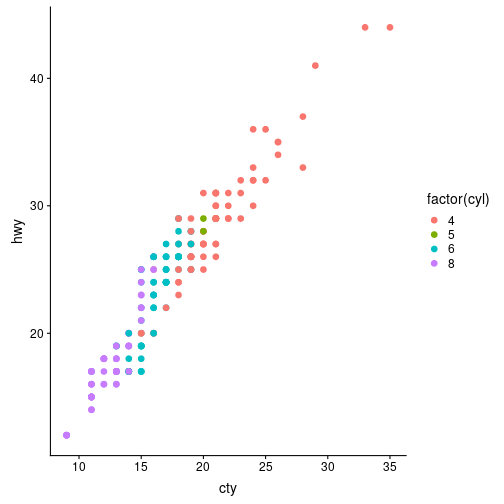

==================

```r
plot.diamonds <- ggplot(diamonds, aes(clarity, fill = cut)) + geom_bar() +
  theme(axis.text.x = element_text(angle=70, vjust=0.5))
plot.diamonds
```

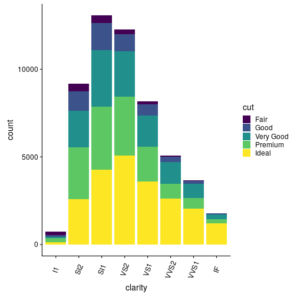

Now, arrange them on a grid
=====================================

```r
plot_grid(plot.mpg, plot.diamonds, labels = c("A", "B"))
```

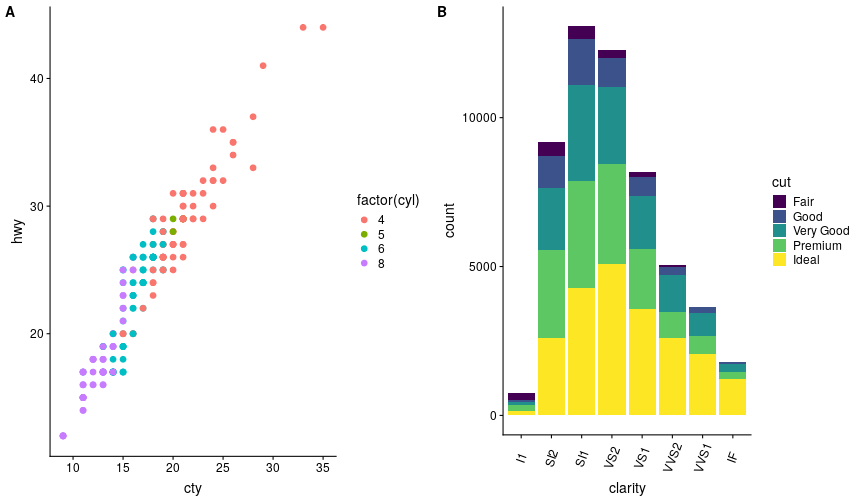

More complex example
================================

```r
plot_grid(plot.mpg, plot.diamonds, plot.diamonds, plot.mpg, labels=c("A","B","C","D"),ncol=2,rel_heights = c(0.5,1))
```

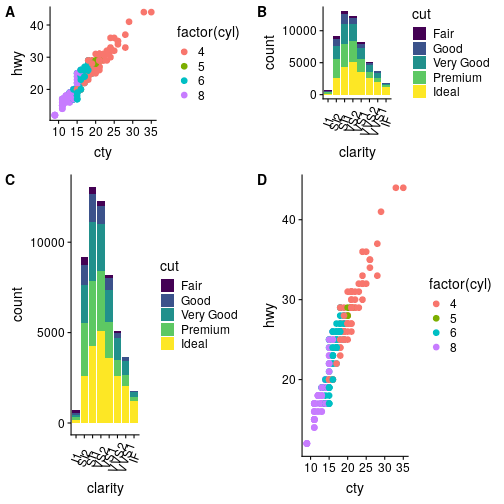

Even more complex
===============================

* See [here](https://cran.r-project.org/web/packages/egg/vignettes/Ecosystem.html), which is part of the [egg](https://cran.r-project.org/web/packages/egg/index.html) package.

Lattice + grid/gridExtra
=====================================================

```r
library(lattice)
library(grid)
library(gridExtra)
lattice.mpg = xyplot(hwy~cty,data=mpg,group=factor(cyl),auto.key=T)
combined = grid.arrange(lattice.mpg, plot.mpg,ncol=2)
grid.draw(combined)
```

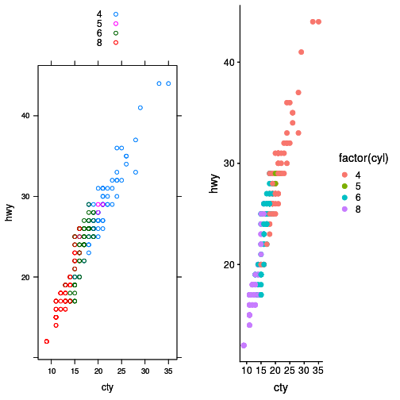

===================================================

```r
lattice.diamonds = histogram(~clarity|cut,data=diamonds)
lattice.diamonds
```

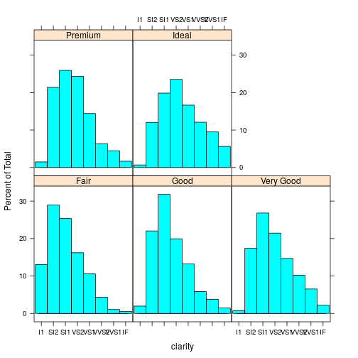

Where layouts matter
==================================================

* Talks, posters,grants
* No one will spend 10 minutes going over your figures, so boil them down to the basics!

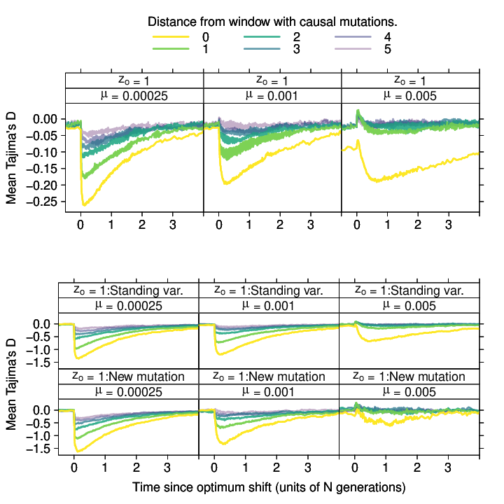

Getting it done
===============================================

* Filter out the data for panels from the original. `dplyr`
* Remove axis data from plots as appropriate
* Combine into one using `grid.arrange`, `cowplot`, etc.
* Generally, this involves "hacking" multiple existing plotting scripts into one.
* But this method is more reliable than Illustrator/Inkscape, and the new script documents exactly what you did!

Automated reports
===========================

* [One method](https://bookdown.org/yihui/rmarkdown/parameterized-reports.html)

Automated reports with a "driver" script
====================================================

A driver can look like this:


```r
# Define the input file name that the template expects
infile <- 'data2.txt'
# Execute the template
rmarkdown::render("ReportTemplate.Rmd")
```

(Show the template...)

littler
=========================================
* [littler](https://cran.r-project.org/web/packages/littler/index.html) will be your friend here.
* Pronounced "little r"
* Introduces **proper scripting semantics to R** OMG.


```sh
#!/usr/bin/env r
if(is.null(argv)) { stop("need some args") }
print("hi")
print(argv[1])
```

Annotated reports using Python
==============================================================================

* Have your Python workflow generate any plots/tables and save them to files in a directory specified by the user
* Use `knitr` to render the report from an `Rmd` file that expects the directory name as a parameter.
* You include the graphics using regular Markdown syntax.

Annotated reports using Python
==============================================================================
For Jupyter notebooks, you have:

* [papermill](https://github.com/nteract/papermill)
* Officially, the Jupyter project views this as "outside the scope"

More generally
======================================================

* Read more about [pandoc](https://pandoc.org) and let me know if you find out anything!

Plotting in Python
====================================================

```r
library(reticulate)
use_python("/usr/bin/python3")
```

Matplotlib
==========================================


```python
import matplotlib.pyplot as plt
import numpy as np
t = np.arange(0.,2.,0.01)
s = 1 + np.sin(2*np.pi*t)
plt.plot(t,s)
plt.grid(True)
plt.show()
```

The output
===============================================
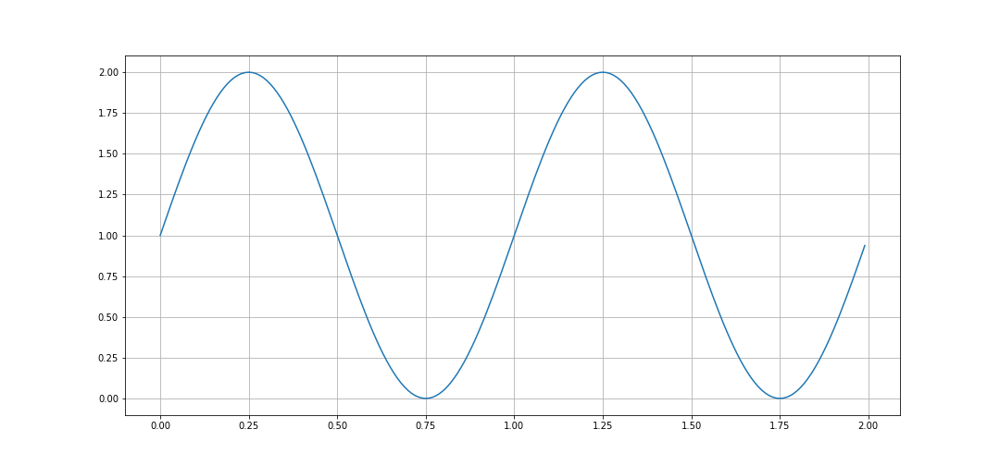

Seaborn
==========================================================


```python
import seaborn as sns
tips = sns.load_dataset("tips")
g = sns.FacetGrid(tips, col="time")
g.map(plt.hist, "tip");
plt.show()
```

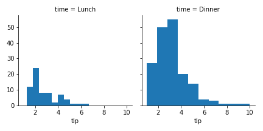

Example 2
=================================================

```python
g = sns.FacetGrid(tips, col="sex", hue="smoker")
g.map(plt.scatter, "total_bill", "tip", alpha=.7)
g.add_legend();
plt.show()
```

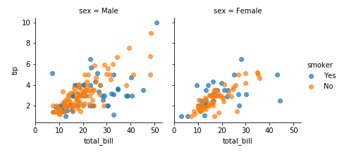

Python is GREAT for adding text!
===================================================

```python
for ax in g.axes.flat:
  ax.set_title(r'$\Theta = \frac{\Gamma}{\sum_{i=1}{10}}$')
plt.show()
```

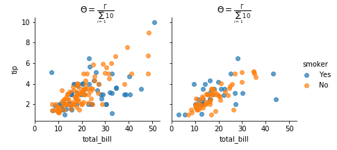
